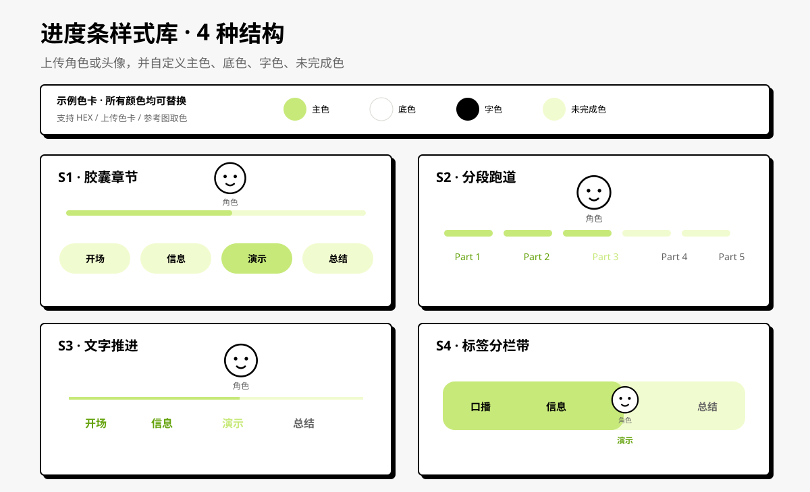

# ElleFlow｜小人走路视频进度条动画

<p align="center">
  
</p>

<p align="center">
  不管是长视频、短视频、Vlog、知识内容还是系列视频，直接把想做进度条的那一条拖进来。ElleFlow 会理解内容、拆分章节，让你的 IP 头像或小人跟着进度走；不用自己反复听视频、卡时间、做关键帧。
</p>

<p align="center">
  <a href="#一分钟开始">一分钟开始</a> · <a href="#你会拿到什么">你会拿到什么</a> · <a href="#四种常用说法">四种常用说法</a> · <a href="#常见问题">常见问题</a> · <a href="#维护与技术信息">维护与技术信息</a>
</p>

---

## 让懒人无痛拥有视频章节进度条

做视频时，想加一个会推进的章节条，往往得反复听视频、卡时间、调关键帧。ElleFlow 把这些麻烦收起来：你先上传一份轻量分析版，它会理解内容、拆分章节；再根据你的选择，把 IP 小人、样式和颜色做成一条高清透明进度条。

最后把透明进度条拖回原来的高清剪映工程，从视频开头对齐即可。原片不需要来回上传、下载或重新合成。

## 一分钟开始

### 1. 安装

把下面这段话发给你正在使用的 Agent：

```text
请帮我安装这个 Skill：
https://github.com/hututu-ai/progress-bar-studio

安装 skill/progress-bar-studio，并告诉我怎样开始使用。
```

安装完成后，重新打开 Agent 或新建一个任务。

### 2. 首次打开，先选你现在的情况

ElleFlow 第一次不会让你背流程，而是先给你一个选择题：

```text
ElleFlow｜小人走路视频进度条动画

先选你现在的情况：

A. 我已经有一份 720p 分析版，直接上传
B. 我有剪映工程，但不知道怎样导出分析版
C. 我想先看看成品会是什么样

回复 A、B 或 C 就行。
```

选 `A`，直接拖进视频；选 `B`，它只会告诉你在剪映导出 `720p` 视频后再上传；选 `C`，先看样式示例，不会直接创建项目。

`720p` 视频只用来识别内容、整理章节和预览进度条，不会替代你准备发布的高清原片。视频特别长或网络较慢时可以用 `480p`，但默认推荐 `720p`，对小字、画面细节和屏幕录制更稳。

> 请在内容剪辑定稿后导出，并保持和原工程相同的时长、画面比例和播放速度。

### 3. 后面只需按编号选，不用一次说清楚

ElleFlow 不会把一堆问题同时丢给你。它每次只问一个选择题，你回复字母、数字或直接说出想法都可以；选完后会告诉你“已经选了什么”和“下一步做什么”。

例如：

```text
进度 2/8｜要不要让角色跟着走？

A. 小人走路：上传一张 IP 图
B. 静态小人：上传一张 IP 图，轻微动起来
C. 不要角色，只做进度条
D. 用我的 ElleFlow 预设

回复 A、B、C 或 D。
```

你也可以随时说“改一下”或“返回上一步”，只改相关内容，不需要重新开始。

---

## 你会拿到什么

你真正需要拿回剪辑软件的是这一份：

| 主交付物 | 你拿它做什么 |
| --- | --- |
| `progress_bar.mov` | 高清透明进度条母版，拖进剪映、PR、Final Cut 等软件，叠加到你的高清原视频上 |

`sample_progress_bar.mov`、章节记录、角色素材和透明检查记录属于 ElleFlow 项目的过程资料：它们会在项目中保留，方便修改、复用和排查，但不会被当成一堆需要你处理的“最终文件”。

ElleFlow 不会替你重导整条原片。高清原视频一直留在你的剪辑工程里，透明进度条才是可复用、可调整、最省上传时间的交付物。

## 你会按这 8 步完成

不用记住流程。每一步 ElleFlow 都会显示 `进度 X/8`，一次只让你做一个选择；支持按钮的 Agent 会显示按钮，不支持时直接回字母或数字也行。

| 步骤 | ElleFlow 会问你什么 | 你只要怎么做 |
| --- | --- | --- |
| 1. 章节 | “这些章节对吗？” | 确认、改时间点，或重新分析 |
| 2. 角色 | “要不要让角色跟着走？” | 选小人走路、静态小人、纯进度条或预设 |
| 3. 样式 | “你更喜欢哪种进度条？” | 选 A-D，或上传一张参考图 |
| 4. 颜色 | “颜色从哪里来？” | 选视频提色、上传品牌图、说一个颜色或让 ElleFlow 推荐 |
| 5. 预设 | “下次要不要复用这套风格？” | 保存，或跳过 |
| 6. 清晰度 | “透明进度条要导出多清晰？” | 选 `1080p`、`2K` 或 `4K` |
| 7. 总预览 | “这套章节、角色、样式和颜色可以吗？” | 开始做样片，或只改你不满意的部分 |
| 8. 样片 | “15 秒效果可以吗？” | 导出完整进度条、修改，或暂时不导出 |

每一步都会回显已经确认的内容，并说明下一步。你随时可以说“改一下”或“返回上一步”，不会因为改一个颜色就要重新做章节。

## 四种常用说法

### 只有视频

```text
给这个视频做进度条。
先把内容拆成章节给我确认，确认后再做后面的设计。
```

### 视频加角色图

```text
给这个视频做进度条。
章节确认后，让这张角色图沿进度条走起来；先给我看走路形象。
```

### 做极简纯进度条

```text
分析这个视频的章节，不使用角色。
做一条简洁的文字进度条，颜色用 #E89AB3。
```

### 明确要叠回高清原片

```text
这是我的 720p 分析版。请按它的章节和时长做一条 2K 透明进度条，
我会拖回原来的高清剪映工程里使用。
```

## 四种样式

| 样式 | 更适合什么视频 |
| --- | --- |
| **S1 章节胶囊** | Vlog、课程、知识讲解，章节要一眼看清 |
| **S2 分段跑道** | 教程、轻松口播、节奏感更强的内容 |
| **S3 文字推进** | 竖屏口播、字幕较多、画面空间有限的视频 |
| **S4 标签分栏带** | 系列内容、分集主题或有明显步骤的视频 |

还可以直接上传你喜欢的进度条截图。ElleFlow 会提取它的轨道、标签和层级逻辑，不会把低清截图直接放大当成成品，也不会保留第三方 Logo、水印或角色。

## 常见问题

### 为什么先上传 720p，不直接上传高清原片？

ElleFlow 主要用视频来理解内容、拆分章节和检查进度条位置。`720p` 通常足够完成这些工作，文件却比高清原片小得多，上传更快。原片留在你的剪映工程，最后由你自己导出高清成片，画质不会被 ElleFlow 再压一次。

### 480p 可以吗？

可以。视频特别长或网络较慢时，`480p` 也能用于大多数口播、Vlog 和知识内容的章节整理。涉及屏幕录制、小字 PPT、代码或表格时，建议使用 `720p`；如果仍看不清，ElleFlow 会请你补一张清晰截图或章节名称，而不是让你默认上传整条高清原片。

### 高清原片后来又剪了几秒，还能直接叠加吗？

不建议。分析版和高清原片必须保持相同的时长、画面比例和播放速度。若后面删改了片段、变速或重新排序，请从更新后的工程再导出一份分析版，避免章节时间点错位。

### 没有角色图，也能做吗？

可以。选择“不使用角色”，就会得到纯章节进度条；也可以后续再补一张角色图。

### 我能把自己常用的角色、样式和配色保存下来吗？

可以。选完角色、样式和颜色后，ElleFlow 会问你是否保存成一个命名预设。只有你明确同意，角色图、参考图、样式路线和颜色才会保存到本地；下次发现它时仍会先问你要不要用，不会悄悄套用旧风格。

### 我能选清晰度吗？

可以。在导出透明进度条前选择 `1080p`、`2K` 或 `4K`。ElleFlow 会根据分析版的真实时长和帧率给出文件大小范围，再由你确认。

### 它会不会直接开始渲染，浪费时间和额度？

不会。章节、角色、样式、颜色、清晰度和 15 秒样片都有确认点。你不确认，它不会擅自进入下一步。

---

## 手动安装

如果你的 Agent 不支持自动安装，可以先下载仓库：

```bash
git clone https://github.com/hututu-ai/progress-bar-studio.git
cd progress-bar-studio
```

再把 `skill/progress-bar-studio` 复制到你的 Agent 技能目录：

| Agent | 常见全局目录 |
| --- | --- |
| Codex | `~/.codex/skills/` |
| Claude Code | `~/.claude/skills/` |
| Cursor | `~/.cursor/skills/` |
| GitHub Copilot | `~/.copilot/skills/` |

例如 Codex：

```bash
mkdir -p ~/.codex/skills
cp -R skill/progress-bar-studio ~/.codex/skills/
```

不同 Agent 的安装目录可能随版本调整；安装后只要目标目录中有 `SKILL.md`、`assets/`、`references/` 和 `scripts/` 即可。

<details>
<summary><strong>维护与技术信息</strong></summary>

### 运行条件

- `ffmpeg` 与 `ffprobe`：探测分析视频、生成样片、导出透明 MOV。
- Python 3：运行检查、预设和交付脚本。
- Pillow：四帧行走素材和 WebP 预览。
- 宿主提供的转写与图像编辑能力：用于自动分章和角色处理。

在开始媒体处理前，可运行预检：

```bash
python3 skill/progress-bar-studio/scripts/preflight.py \
  --source-video /path/to/analysis-video.mp4 \
  --output-dir /path/to/output \
  --json
```

它会检查 FFmpeg、ProRes 4444 编码器、Pillow、分析视频、目标文件夹和磁盘空间。转写、图像编辑和剪辑软件导入能力由正在使用的 Agent 与本机软件决定。

### 本地验证

```bash
python3 -m pip install Pillow
python3 -m unittest discover -s tests -v
```

测试会生成临时短视频，覆盖无音频提示、竖屏探测、损坏媒体、不可写输出目录、磁盘不足、透明 Alpha 校验、同名任务版本化、无角色路径和可复用预设。GitHub Actions 会在推送到 `main` 或提交 Pull Request 时运行同一套检查。

### 项目结构

```text
progress-bar-studio/
├── README.md
├── CHANGELOG.md
├── LICENSE
├── .github/workflows/validate.yml
├── tests/
└── skill/progress-bar-studio/
    ├── SKILL.md
    ├── agents/openai.yaml
    ├── assets/
    ├── references/
    └── scripts/
```

### 许可证

本项目采用 [MIT License](LICENSE)，可使用、修改和分发，但须保留许可证与版权声明。

</details>
