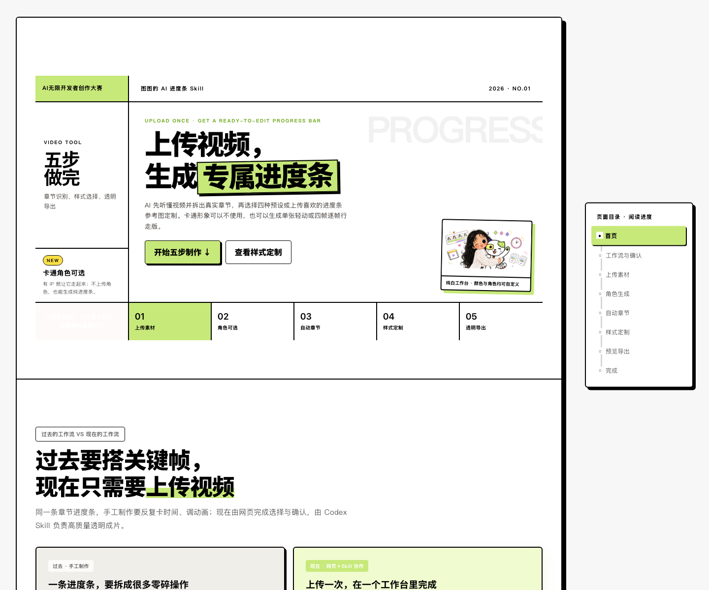

# Progress Bar Studio｜AI 动态进度条 Skill

上传视频，AI 自动识别章节、处理角色、匹配样式，并导出可直接导入剪辑软件的透明动态进度条。



## 能做什么

| 功能 | 结果 |
| --- | --- |
| 自动拆章节 | 根据语音内容和话题转折生成 4–7 个时间准确、名称简短的章节 |
| 处理角色 | 支持无角色、单张轻动、固定四帧逐帧行走；保留原角色的外形、配色和标志性细节 |
| 匹配进度条 | 提供 S1 章节胶囊、S2 分段跑道、S3 文字推进、S4 标签分栏带 |
| 参考图定制 | 上传喜欢的进度条图片，AI 提取轨道、节点、标签、填充和行走平面，重建为专属版本 |
| 自定义配色 | 支持 HEX、色盘和参考图取色，自动生成主色、底色、深色与文字色 |
| 透明导出 | 输出透明 PNG、四帧素材、动画预览及 ProRes 4444 MOV，并检查 Alpha 通道 |


## 支持哪些 Agent

本仓库采用标准 `SKILL.md + scripts + references + assets` 结构。

| Agent | 个人安装目录 | 项目安装目录 | 调用方式 |
| --- | --- | --- | --- |
| **Codex Desktop / Codex CLI** | `~/.codex/skills/` | `.codex/skills/` | 直接描述任务，Codex 会按需求加载 Skill |
| **Claude Code** | `~/.claude/skills/` | `.claude/skills/` | 输入 `/progress-bar-studio`，或直接描述进度条需求 |
| **Cursor Agent / Cursor CLI** | `~/.cursor/skills/` | `.cursor/skills/` | 在 Agent 对话中输入 `/progress-bar-studio`，也支持自动调用 |
| **GitHub Copilot CLI / coding agent / IDE agent mode** | `~/.copilot/skills/` | `.github/skills/` 或 `.agents/skills/` | 直接描述任务，让 Copilot 加载对应 Skill |

目录规则来自 [Claude Code Skills 文档](https://code.claude.com/docs/en/slash-commands)、[Cursor Agent Skills 文档](https://cursor.com/docs/skills) 和 [GitHub Copilot Agent Skills 文档](https://docs.github.com/en/copilot/concepts/agents/about-agent-skills)。

**完整媒体流程已在 Codex 中验证。** 其他 Agent 可以识别本 Skill 的标准结构；实际生成透明动画还需要该 Agent 能读取本地视频、执行脚本、调用图像处理能力，并获得对应文件权限。

## 安装

### 1. 下载仓库

```bash
git clone https://github.com/hututu-ai/progress-bar-studio.git
cd progress-bar-studio
```

### 2. 复制 Skill

按你使用的 Agent 选择一条命令。

**Codex：**

```bash
mkdir -p ~/.codex/skills
cp -R skill/progress-bar-studio ~/.codex/skills/
```

**Claude Code：**

```bash
mkdir -p ~/.claude/skills
cp -R skill/progress-bar-studio ~/.claude/skills/
```

**Cursor：**

```bash
mkdir -p ~/.cursor/skills
cp -R skill/progress-bar-studio ~/.cursor/skills/
```

**GitHub Copilot：**

```bash
mkdir -p ~/.copilot/skills
cp -R skill/progress-bar-studio ~/.copilot/skills/
```

个人目录让 Skill 对所有项目生效。需要随项目共享时，把同一文件夹复制到上表对应的项目目录并提交到 Git。

### 3. 检查安装

目标目录中应存在：

```text
progress-bar-studio/
├── SKILL.md
├── assets/
├── references/
└── scripts/
```

重新打开 Agent，或新建一个任务，让它重新扫描 Skills。

## 怎么使用

### 准备素材

至少上传一段带声音的视频。以下素材按需提供：

- 角色原图：需要角色随进度移动时上传；
- 进度条参考图：需要复刻某种结构时上传；
- 品牌色：直接提供 HEX，例如 `#E89AB3`；
- 输出目录：需要保存到指定硬盘或项目文件夹时提供。

### 直接发送需求

**四帧行走角色：**

```text
使用 progress-bar-studio 处理这个视频。
分析真实语音内容并划分章节，使用我上传的角色生成四帧逐帧行走版本。
选择 S1 章节胶囊，主色 #E89AB3，透明底，导出 ProRes 4444 MOV，适配剪映。
```

**单张轻动角色：**

```text
给这个视频制作章节进度条。使用角色单张轻动模式，选择 S2 分段跑道。
先给我章节时间轴和静态预览，确认后再制作完整版。
```

**不使用角色：**

```text
分析视频章节，使用 S3 文字推进样式制作纯进度条。
使用粉色系，透明底，输出 3840 像素宽的透明 MOV。
```

**参考图定制：**

```text
使用我上传的进度条参考图进行自定义重建。
保留它的轨道、节点和标签层级，替换为本视频章节与我的角色，配色改为 #E89AB3。
先确认结构拆解和静态效果，再导出透明完整版。
```

## 执行流程

| 步骤 | Skill 会做什么 | 需要你确认什么 |
| --- | --- | --- |
| **01 上传素材** | 检查视频时长、画幅、帧率、音频、输出位置与磁盘空间 | 素材是否正确 |
| **02 处理角色** | 跳过角色，或生成单张轻动 / 四帧行走角色，检查身份一致性与脚底基线 | 角色造型与动作 |
| **03 分析章节** | 转写语音，按内容转折生成时间戳、章节名与划分理由 | 章节数量、名称和边界 |
| **04 样式配色** | 选择四种预设之一，或拆解参考图并重建；让角色与轨道正确贴合 | 静态叠加效果 |
| **05 预览导出** | 检查字幕避让、章节切换、多背景透明度和剪辑软件导入参数 | 样片和最终交付清单 |

角色位置由样式规则决定，Skill 不会重复询问“角色放在哪里”。每一步确认后才继续，避免重复生成和浪费模型额度。

## 输出文件

根据选择的模式生成以下文件：

- `character.png`：透明角色 PNG；
- `walk_01.png`–`walk_04.png`：四帧透明步态；
- `walk.webp`：四帧循环预览；
- `chapters.json`：章节时间轴和名称；
- `style.json`：样式、配色和尺寸记录；
- `progress_bar.mov`：透明 ProRes 4444 母版；
- `preview.mp4`：带原视频声音的轻量叠加预览；
- `qc/`：Alpha、多背景和章节边界质检图。

默认“4K 进度条”指 **3840 像素宽的透明条带**，高度由样式决定。

## 运行条件

- 支持本地文件读写和命令执行的 Agent；
- `ffmpeg` 与 `ffprobe`；
- Python 3；
- Pillow（使用四帧拆分脚本时需要）；
- 可用的图像生成或图像编辑能力（生成新姿势时需要）；
- 足够的磁盘空间保存透明 MOV。

## 附带工具

| 文件 | 用途 |
| --- | --- |
| `probe_video.sh` | 探测视频尺寸、帧率、时长、音频和磁盘空间 |
| `split_walk_cycle.py` | 拆分四帧精灵图，检查脚底基线并生成 WebP 预览 |
| `make_multibg_preview.sh` | 在多种背景上检查透明边缘 |
| `verify_alpha_mov.sh` | 逐帧验证 ProRes 4444 的 Alpha 通道 |

## 仓库结构

```text
progress-bar-studio/
├── README.md
├── docs/images/                     # README 截图
└── skill/progress-bar-studio/
    ├── SKILL.md                     # 主工作流与执行规则
    ├── agents/openai.yaml           # Codex 展示信息
    ├── assets/                      # 四种样式与矢量模板
    ├── references/                  # 章节、角色、样式、确认与导出规范
    └── scripts/                     # 视频探测、拆帧和透明度质检
```

## 使用提醒

- 请上传自己拥有或获准使用的视频、角色和参考图；
- 参考图用于提取版式结构，不保留第三方角色、Logo、水印或专有图形；
- 正式交付前，请在目标剪辑软件中完成一次实际导入测试；
- 透明 MOV 体积较大，渲染前先确认输出目录剩余空间。
